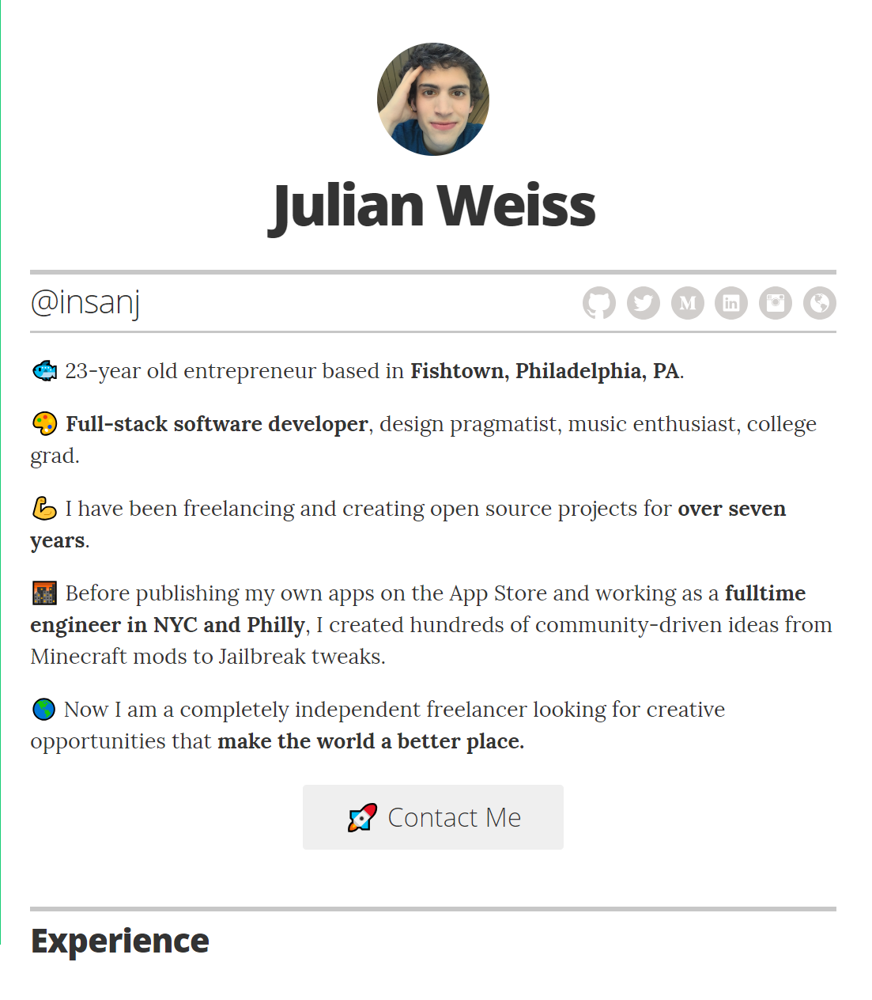

   
   <h3 align="center">resume</h3>
   <h4 align="center">📃 hire me! resume built with <a href="https://github.com/jekyll/jekyll">jekyll</a> & <a href="https://github.com/jglovier/resume-template">resume-template</a></h4>
   
🌎 <a href="https://insanj.com/_resume/_site/">Check it out live</a> or 🌌 <a href="https://insanj.github.io/resume/">Run it from Github</a>!

---

---

## [License](LICENSE)

    See LICENSE file for original license.
    @insanj/resume Copyright (C) 2018-2023. Julian (insanj) Weiss

    This program is free software: you can redistribute it and/or modify
    it under the terms of the GNU General Public License as published by
    the Free Software Foundation, either version 3 of the License, or
    (at your option) any later version.

    This program is distributed in the hope that it will be useful,
    but WITHOUT ANY WARRANTY; without even the implied warranty of
    MERCHANTABILITY or FITNESS FOR A PARTICULAR PURPOSE.  See the
    GNU General Public License for more details.

    You should have received a copy of the GNU General Public License
    along with this program.  If not, see <http://www.gnu.org/licenses/>.
